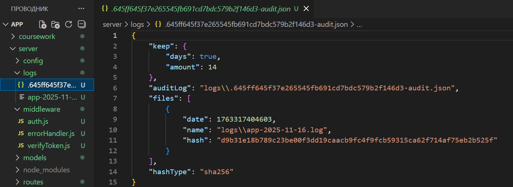
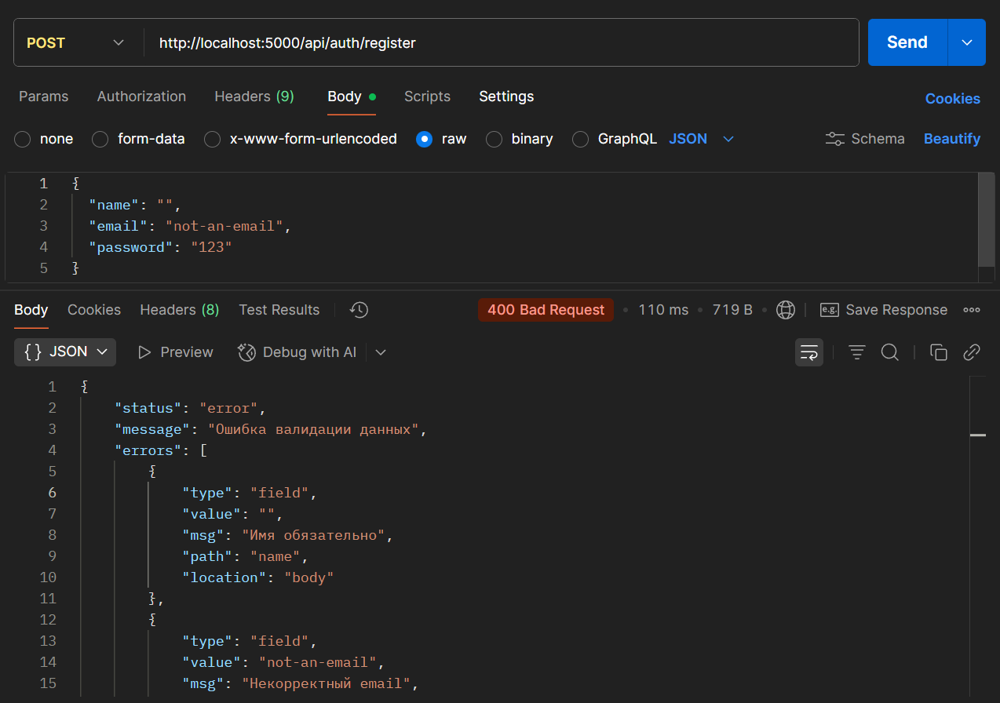
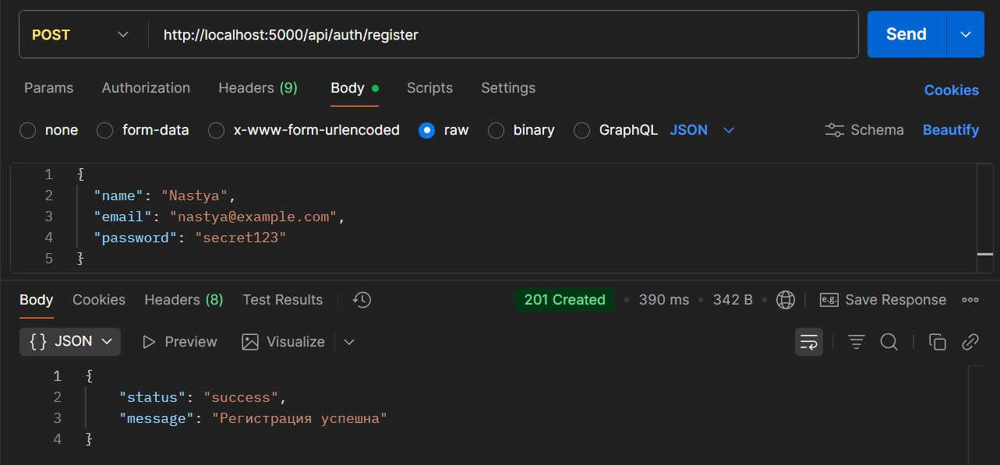
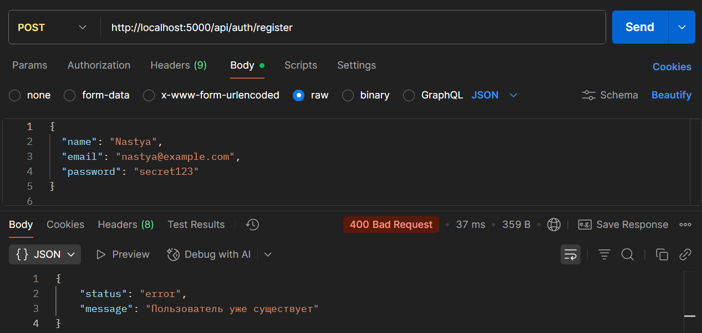
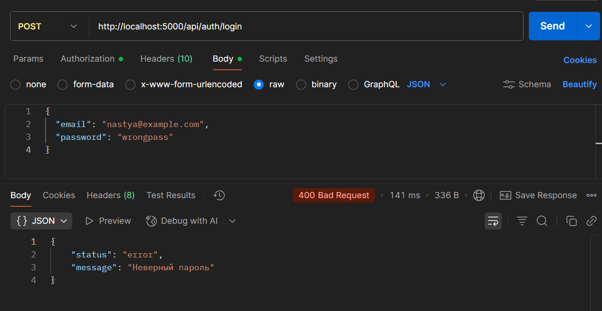
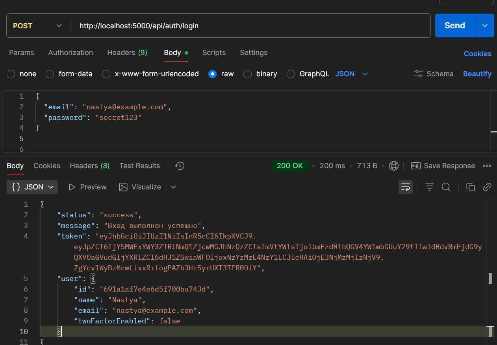
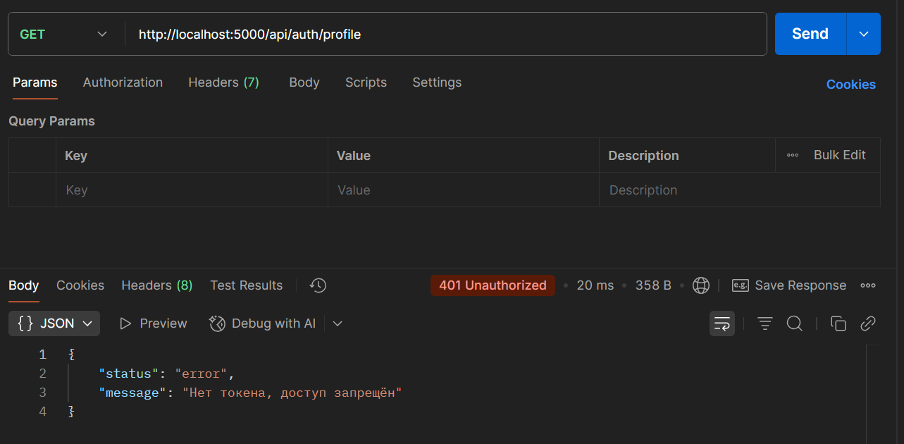
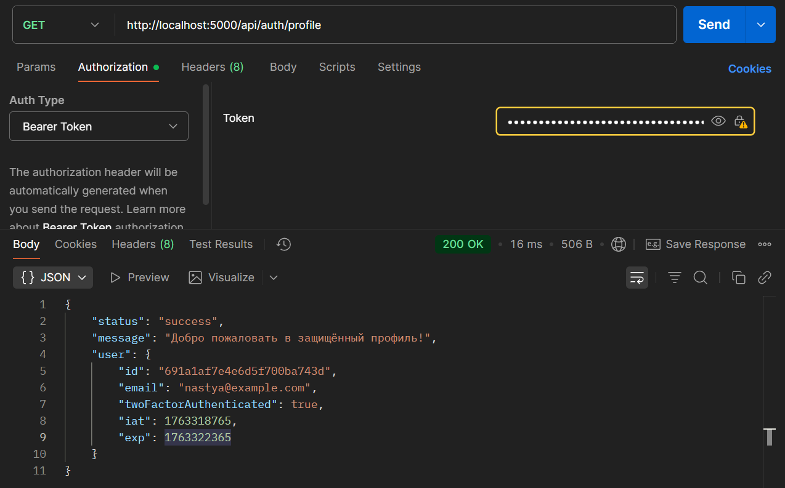
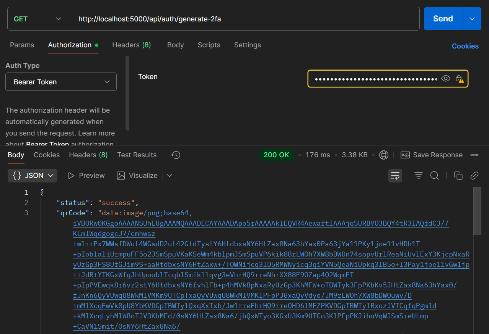

# Лабораторная работа №4 — Обработка ошибок, валидация, логирование и Sentry в Express.js

## Описание проекта

Проект представляет собой серверную часть приложения аутентификации на **Node.js + Express**, с поддержкой:

- регистрации и логина пользователей;
- JWT-аутентификации;
- двухфакторной аутентификации (2FA) на базе TOTP (например, Google Authenticator);
- OAuth-авторизации через Google и GitHub.

В рамках лабораторной работы приложение было доработано следующим образом:

1. Реализована **централизованная обработка ошибок**.
2. Добавлена **валидация входящих данных** с использованием `express-validator`.
3. Настроено **логирование запросов и ошибок** с ротацией файлов логов.
4. Интегрирован сервис **Sentry** для отслеживания ошибок в реальном времени.

---

## Использованые технологий

- **Node.js**, **Express.js**
- **MongoDB**, **Mongoose**
- **JWT** (`jsonwebtoken`)
- **express-validator**
- **winston**, **winston-daily-rotate-file**, **morgan**
- **@sentry/node**
- **speakeasy**, **qrcode**
- **passport**, **passport-google-oauth20**, **passport-github2**

---

## Структура проекта (основное)

```
app/
├── index.js               # Точка входа, подключение БД, логирование, Sentry, маршруты
├── logger.js              # Настройка winston и ротации логов
├── server/
│   ├── config/
│   │   └── passport.js    # Настройка стратегий OAuth (Google, GitHub)
│   ├── middleware/
│   │   ├── auth.js        # Проверка JWT-токена для защищённых маршрутов
│   │   ├── verifyToken.js # Проверка временного/основного токена (2FA)
│   │   └── errorHandler.js# Централизованный обработчик ошибок
│   ├── models/
│   │   └── User.js        # Модель пользователя
│   └── routes/
│       └── auth.js        # Все маршруты аутентификации и 2FA
└── utils/
    ├── asyncHandler.js    # Обёртка для async-обработчиков маршрутов
    └── errors/
        ├── AppError.js        # Базовый класс ошибок
        ├── ValidationError.js # Ошибка валидации данных
```

## Ошибка валидации ValidationError

Файл: utils/errors/ValidationError.js

```
const AppError = require("./AppError");

class ValidationError extends AppError {
  constructor(message = "Ошибка валидации данных", errors = []) {
    super(message, 400);
    this.errors = errors;
  }
}

module.exports = ValidationError;
```

Содержит:

- message — общее описание ошибки;
- errors — массив с конкретными ошибками по полям.

## Обёртка для async-обработчиков asyncHandler

Файл: utils/asyncHandler.js

```
module.exports = (fn) => (req, res, next) => {
  Promise.resolve(fn(req, res, next)).catch(next);
};
```

Используется во всех асинхронных маршрутах, чтобы автоматически передавать исключения в общий обработчик ошибок.

Централизованный обработчик ошибок errorHandler
Файл: server/middleware/errorHandler.js

Основные обязанности:

- логирование ошибки через winston;
- отправка ошибок (кроме валидационных) в Sentry;
- возврат клиенту ответа в унифицированном формате.

Ключевые моменты:

```
if (!(err instanceof ValidationError)) {
  Sentry.captureException(err);
}

logger.error({
  message: err.message,
  stack: err.stack,
  statusCode: err.statusCode || 500,
  path: req.originalUrl,
  method: req.method,
});
```

- Формат для ValidationError

```
if (err instanceof ValidationError) {
  return res.status(400).json({
    status: "error",
    message: err.message,
    errors: err.errors,
  });
}
```

- Формат для остальных ошибок

```
return res.status(statusCode).json({
  status: "error",
  message: err.message || "Внутренняя ошибка сервера",
});
```

Подключение обработчика в приложении
Файл: index.js

```
const errorHandler = require("./middleware/errorHandler");
```

- Централизованный обработчик ошибок (после всех роутов)
  app.use(errorHandler);

## Шаг 2. Валидация данных (express-validator)

Валидация выполняется на уровне маршрутов в server/routes/auth.js.

Валидация регистрации пользователя
Маршрут: POST /api/auth/register

Проверяем:

- name — не пустое;
- email — корректный формат email;
- password — длина не менее 6 символов.

```
router.post(
  "/register",
  [
    body("name").trim().notEmpty().withMessage("Имя обязательно"),
    body("email").isEmail().withMessage("Некорректный email"),
    body("password")
      .isLength({ min: 6 })
      .withMessage("Пароль должен быть не менее 6 символов"),
  ],
  asyncHandler(async (req, res) => {
    handleValidation(req);
  })
);
```

Функция обработки результатов валидации:

```
const handleValidation = (req) => {
  const errors = validationResult(req);
  if (!errors.isEmpty()) {
    throw new ValidationError("Ошибка валидации данных", errors.array());
  }
};
```

- Валидация логина
  Маршрут: POST /api/auth/login

```
router.post(
  "/login",
  [
    body("email").isEmail().withMessage("Некорректный email"),
    body("password").notEmpty().withMessage("Пароль обязателен"),
  ],
  asyncHandler(async (req, res) => {
    handleValidation(req);
  })
);
```

При ошибках валидации клиент получает ответ:

```
{
  "status": "error",
  "message": "Ошибка валидации данных",
  "errors": [
    {
      "msg": "Некорректный email",
      "param": "email",
      "location": "body"
    }
  ]
}
```

## Шаг 3. Логирование запросов и ошибок

- Логгер winston с ротацией файлов
  Файл: logger.js
  создаёт логи в директории logs/;
  каждый день — новый файл: app-YYYY-MM-DD.log;
  хранение логов — 14 дней;
  в режиме разработки дополнительно выводит логи в консоль.

```
const winston = require("winston");
require("winston-daily-rotate-file");

const transport = new winston.transports.DailyRotateFile({
  filename: "logs/app-%DATE%.log",
  datePattern: "YYYY-MM-DD",
  maxFiles: "14d",
});

const logger = winston.createLogger({
  level: "info",
  format: winston.format.combine(
    winston.format.timestamp(),
    winston.format.json()
  ),
  transports: [transport],
});

if (process.env.NODE_ENV !== "production") {
  logger.add(new winston.transports.Console({ format: winston.format.simple() }));
}

module.exports = logger;
```

- HTTP-логирование через morgan
  Файл: index.js

```
const morgan = require("morgan");
const logger = require("./logger");

app.use(
  morgan("combined", {
    stream: {
      write: (msg) => logger.info(msg.trim()),
    },
  })
);
```

Все HTTP-запросы (метод, URL, статус, время) попадают в файлы логов.

- Логирование ошибок
  В middleware/errorHandler.js каждая ошибка логируется отдельно:

```
logger.error({
  message: err.message,
  stack: err.stack,
  statusCode: err.statusCode || 500,
  path: req.originalUrl,
  method: req.method,
});
```

- Скриншоты логов

Созданный файл логов и audit-файл в директории logs/:



Пример содержимого файла app-YYYY-MM-DD.log:

## Шаг 4. Интеграция Sentry

- Инициализация Sentry
  Файл: index.js

```
const Sentry = require("@sentry/node");

Sentry.init({
  dsn: process.env.SENTRY_DSN,
});
```

Отправка ошибок в Sentry
Файл: middleware/errorHandler.js

```
if (!(err instanceof ValidationError)) {
  Sentry.captureException(err);
}
```

Таким образом:
отправляются серверные и логические ошибки (ошибки БД, неверная логика и т.п.);
не отправляются ошибки валидации данных (ValidationError), чтобы не засорять отчёты Sentry.

## Тестирование через Postman

Ниже — последовательность тестов, подтверждающая корректную работу приложения.

Тест 1 — Ошибка валидации при регистрации
Метод: POST
URL: /api/auth/register
Body (JSON):

```
{
  "name": "",
  "email": "not-an-email",
  "password": "123"
}
```

Ожидаемый результат: 400 Bad Request, статус "error", сообщение "Ошибка валидации данных" и массив ошибок.



Тест 2 — Успешная регистрация
Body (JSON):

```
{
  "name": "Nastya",
  "email": "nastya@example.com",
  "password": "secret123"
}
```

Ожидаемый результат: 201 Created, статус "success", сообщение "Регистрация успешна".

Скриншот:


Тест 3 — Повторная регистрация (пользователь уже существует)
Тот же запрос, что в тесте 2.

Ожидаемый результат: 400 Bad Request, статус "error", сообщение "Пользователь уже существует".

Скриншот:


Тест 4 — Неверный пароль при логине
Метод: POST
URL: /api/auth/login
Body:

```
{
  "email": "nastya@example.com",
  "password": "wrongpass"
}
```

Ожидаемый результат: 400 Bad Request, статус "error", сообщение "Неверный пароль".

Скриншот:


Тест 5 — Успешный логин
Body:

```
{
  "email": "nastya@example.com",
  "password": "secret123"
}
```

Результат: 200 OK, статус "success", сообщение "Вход выполнен успешно", в ответе — JWT-токен и данные пользователя.

Скриншот:


Тест 6 — Доступ к защищённому маршруту без токена
Метод: GET
URL: /api/auth/profile
Без заголовка Authorization
Результат: 401 Unauthorized, статус "error", сообщение "Нет токена, доступ запрещён".

Скриншот:



Тест 7 — Доступ к защищённому маршруту с токеном
Метод: GET
URL: /api/auth/profile
Headers:
txt
Копировать код
Authorization: Bearer <JWT*из*успешного_логина>
Результат: 200 OK, статус "success", сообщение "Добро пожаловать в защищённый профиль!", в user — данные пользователя.

Скриншот:


Тест 8 — Генерация QR-кода для 2FA
Метод: GET

URL: /api/auth/generate-2fa

Headers:
txt
Копировать код
Authorization: Bearer <JWT*из*успешного_логина>
Результат: 200 OK, статус "success", поле qrCode с изображением в формате data:image/png;base64,....

Скриншот:


## Вывод

В результате работы:
реализована централизованная обработка ошибок с использованием собственных классов AppError и ValidationError;
добавлена валидация данных для ключевых маршрутов (register, login, verify-2fa, enable-2fa) с единым форматом ответа при ошибках;
настроено логирование запросов и ошибок в файлы с ротацией (winston + daily-rotate-file), что повышает удобство отладки и эксплуатации;
интегрирован Sentry для мониторинга ошибок в реальном времени, при этом ошибки валидации исключены из отправки, чтобы не засорять отчёты.
Приложение стало более надёжным, предсказуемым и готовым к эксплуатации в реальных условиях.

# Контрольные вопросы

1. Какие преимущества централизованной обработки ошибок в Express?
   Централизованная обработка ошибок позволяет:

- возвращать ошибки в едином формате;
- легче поддерживать и расширять приложение;
- обрабатывать как синхронные, так и асинхронные ошибки;
- автоматически логировать ошибки и отправлять их в Sentry;
- повышать стабильность и безопасность приложения.

2. Какие категории логов вы решили вести в системе и чем обусловлен ваш выбор?
   В системе ведутся следующие категории логов:

- HTTP-запросы — для анализа работы API и отладки;
- ошибки — для выявления и диагностики проблем;
- архивные логи (с ротацией) — для хранения истории работы приложения и предотвращения переполнения диска.
  Выбор обусловлен необходимостью контролировать работу сервера, сохранять историю и отслеживать ошибки в реальном времени.

3. Какие существуют подходы к валидации данных в Express и какие из них вы использовали?
   Основные подходы к валидации:

- использование express-validator (применено в проекте);
- использование Joi/Celebrate;
- ручная валидация в маршрутах;
- встроенная валидация Mongoose.

В проекте использован express-validator, так как он обеспечивает удобную декларативную проверку данных и единый формат ошибок.
