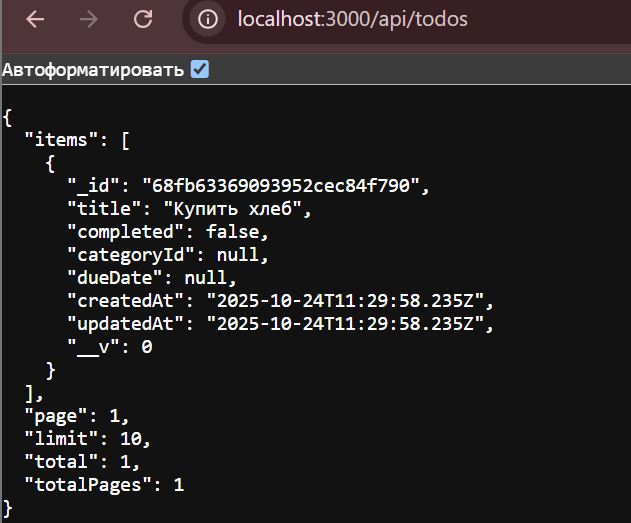
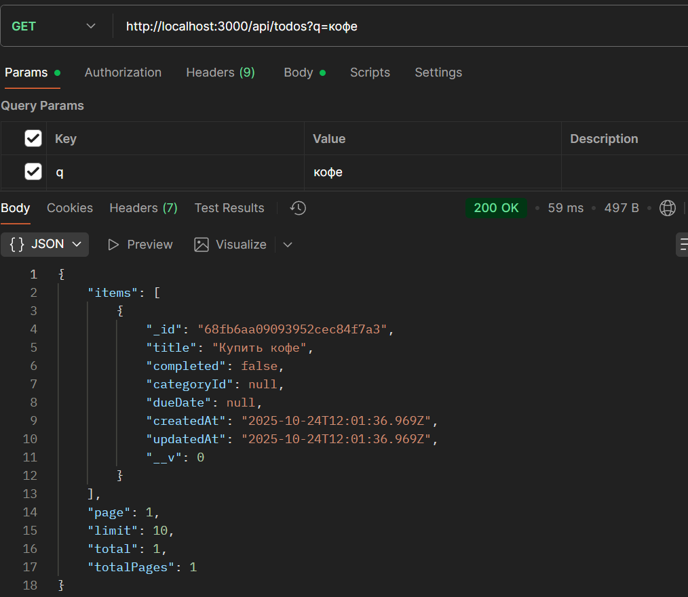

# Лабораторная работа № 2

## Цель работы

Научиться проектировать и реализовывать REST API с несколькими связанными сущностями.
Освоить работу с PostgreSQL в приложении на Node.js + Express с использованием ORM или сырых SQL-запросов.
Реализовать корректные операции CRUD, а также фильтрацию, сортировку и пагинацию.
Освоить принципы работы связей «один ко многим» (1:N) в реляционных базах данных.

## Условие

Разработать сервис для управления задачами (todo list) с возможностью:
Просмотра списка задач.
Создания новой задачи.
Переключения статуса задачи (выполнена/не выполнена).
Удаления задачи.
Редактирования задачи.
Фильтрации задач по категориям.
Поиска задач по заголовку.
Пагинации списка задач.
В проекте должны быть реализованы две сущности:

categories — категории задач,
todos — сами задачи, каждая из которых относится к одной категории.
Сервис должен работать только как REST API, без HTML и шаблонов.

Все ответы и ошибки возвращаются в формате JSON.


## Шаг 1. Создание базы данных
Для хранения информации о задачах и категориях выбрана база данных MongoDB, так как она:

* обеспечивает гибкое документ-ориентированное хранение без необходимости ручного описания таблиц и миграций;
* легко интегрируется с Node.js через библиотеку Mongoose;
* позволяет быстро выполнять CRUD-операции и масштабировать приложение при необходимости.

### Подключение MongoDB

В проект была установлена библиотека mongoose и добавлено подключение к локальной базе:
```
const mongoose = require("mongoose");
mongoose
  .connect("mongodb://127.0.0.1:27017/todoapp")
  .then(() => console.log("MongoDB подключена"))
  .catch((err) => console.error("Ошибка подключения к MongoDB:", err));
``` 

При запуске сервер соединяется с базой данных todoapp.
Mongoose автоматически создаёт коллекции при первом сохранении данных.

### Созданные сущности
Вместо SQL-таблиц были определены две Mongoose-схемы, соответствующие требованиям задания.

1. Категории (models/Category.js)

Хранят названия категорий задач.
```
const categorySchema = new mongoose.Schema(
  {
    name: { type: String, required: true, trim: true, maxlength: 100 },
  },
  { timestamps: true }   // createdAt, updatedAt
);
```

2. Задачи (models/Todo.js)

Хранят сами задачи и ссылку на категорию.
```
const todoSchema = new mongoose.Schema(
  {
    title: { type: String, required: true, minlength: 2, maxlength: 120 },
    completed: { type: Boolean, default: false },
    categoryId: { type: mongoose.Schema.Types.ObjectId, ref: "Category" },
    dueDate: { type: Date },
  },
  { timestamps: true }
);
```

Почему было принято использовать MongoDB

* Отсутствие сложных миграций — структура коллекций задаётся прямо в коде.
* Динамическая структура документов позволяет добавлять новые поля без изменения схемы.
* Простая интеграция с Express через Mongoose-методы (find, create, update, deleteOne).
* Удобное прототипирование и высокая скорость разработки по сравнению с реляционными СУБД.

## Шаг 2. Создание моделей

Для работы с данными использовалась библиотека Mongoose, которая выполняет ту же роль, что ORM в реляционных базах данных — она описывает структуру документов, выполняет валидацию данных и обеспечивает удобный доступ к коллекциям MongoDB.

В рамках данного шага были созданы две модели:
Todo — для задач,
Category — для категорий задач.

```
const mongoose = require("mongoose");

const categorySchema = new mongoose.Schema(
  {
    name: {
      type: String,
      required: true,
      trim: true,
      maxlength: 100,
    },
  },
  { timestamps: true }
);

module.exports = mongoose.model("Category", categorySchema);
```
* name — обязательное поле, не может быть пустым;
* trim — автоматически удаляет лишние пробелы в начале и конце строки;
* timestamps — создаёт createdAt и updatedAt автоматически.

В файле models/Todo.js описывается основная сущность приложения - задачу.

* title — обязательное поле с валидацией длины от 2 до 120 символов;
* completed — логическое поле (по умолчанию false);
* categoryId — ссылка на категорию через ObjectId (внешний ключ для связи между коллекциями);
* dueDate — дата, до которой нужно выполнить задачу;
* timestamps — автоматически добавляет время создания и обновления документа.

### Результат шага

* Созданы две модели данных: Category и Todo.
* Реализована встроенная валидация данных на уровне схем (minlength, maxlength, required).
* Обеспечена связь один-ко-многим: одна категория может содержать множество задач.

Использование Mongoose позволяет работать с MongoDB так же удобно, как с ORM в реляционных базах данных (например, Sequelize или Prisma).

## Шаг 3. Реализация REST API

На данном этапе был реализован RESTful API для работы с двумя сущностями:
* Категории (/api/categories)
* Задачи (/api/todos)
Все ответы возвращаются в формате JSON,
а при ошибках сервер возвращает понятный JSON-объект с описанием причины.

API для категорий (/api/categories)
Маршруты:
GET	/api/categories	Получить список всех категорий	200
GET	/api/categories/:id	Получить категорию по ID	200 / 404
POST	/api/categories	Создать новую категорию	201
PUT	/api/categories/:id	Обновить название категории	200 / 404
DELETE	/api/categories/:id	Удалить категорию	204 / 404

API для задач (/api/todos)
Маршруты:
GET	/api/todos	Получить список задач с поиском и пагинацией	200
GET	/api/todos/:id	Получить задачу по ID	200 / 404
POST	/api/todos	Создать задачу	201
PUT	/api/todos/:id	Изменить задачу	200 / 404
PATCH	/api/todos/:id/toggle	Переключить статус задачи	200 / 404
DELETE	/api/todos/:id	Удалить задачу	204 / 404

POST /api/todos успешно создаёт задачу,
GET /api/todos корректно возвращает список,
База MongoDB сохраняет данные в коллекции todos.


добавление задачи и переключение ее стотояния 
* GET http://localhost:3000/api/todos?status=completed
* GET http://localhost:3000/api/todos?status=active


удаление задачи 




Проверка поиска
* GET http://localhost:3000/api/todos?q=хлеб


Проверка фильтрации по категории
* GET http://localhost:3000/api/todos?categoryId=68fb6a7c9093952cec84f79f


Проверка пагинации
* GET http://localhost:3000/api/todos?page=1&limit=5


# Контрольные вопросы

1. Что такое реляционная база данных и какие преимущества она предоставляет?

Реляционная база данных (РБД) — это база, в которой данные хранятся в виде таблиц (строки — записи, столбцы — поля).
Преимущества:

* Чёткая структура данных.
* Возможность связывать таблицы между собой.
* Поддержка транзакций (данные сохраняются надёжно).
* Использование языка SQL для запросов.
* Целостность и согласованность данных.

2. Какие типы связей между таблицами существуют в реляционных базах данных?

* Один к одному (1:1) — каждому объекту одной таблицы соответствует один объект другой.
* Один ко многим (1:N) — один объект связан с несколькими (например, категория → задачи).
* Многие ко многим (M:N) — несколько объектов одной таблицы связаны с несколькими другой (например, пользователи ↔ проекты).

3. Что такое RESTful API и для чего он используется?

REST API — это способ взаимодействия клиента и сервера через HTTP-запросы (GET, POST, PUT, DELETE и т. д.).

Используется для:
* обмена данными между фронтендом и бэкендом;
* построения сервисов, которые можно подключать к любым приложениям;
* обеспечения универсального формата ответов — чаще всего JSON.

4. Что такое SQL-инъекция и как защититься от неё?

SQL-инъекция — это атака, при которой злоумышленник подставляет вредоносный SQL-код в запрос.
Например: SELECT * FROM users WHERE name = 'admin' OR '1'='1'.

Защита:
* Использовать параметризованные запросы (или ORM).
* Не вставлять данные напрямую в SQL.
* Проверять и валидировать входные данные.
(в MongoDB аналог — "NoSQL injection", но принципы защиты те же)

5. В чем разница между ORM и сырыми SQL-запросами?

ORM (Object-Relational Mapping) — это инструмент, который позволяет работать с базой данных через объекты и методы языка программирования, а не через SQL.
Например, вместо запроса SELECT * FROM todos WHERE completed = false, вы просто пишете Todo.find({ completed: false }).
ORM автоматически генерирует SQL-запросы и заботится о безопасности и структуре данных.

Преимущества ORM:
* меньше кода и ошибок;
* защита от SQL-инъекций;
* независимость от конкретной СУБД;
* более понятная структура кода.

Недостатки ORM:
* меньшая производительность по сравнению с «чистыми» SQL-запросами;
* меньше гибкости при сложных запросах.

Сырые SQL-запросы дают полный контроль над логикой и структурой запросов. Они быстрее и позволяют оптимизировать работу с БД, но требуют больше знаний и аккуратности (легко допустить ошибку или уязвимость).

